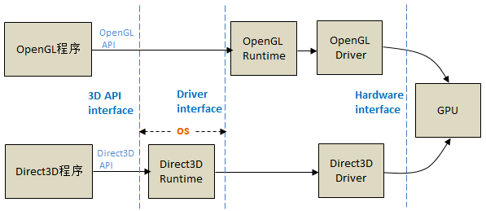

# 相关背景

## WebGL历史

* 1992 OpenGL
* 2003 年 7 月 28 日 OpenGL ES 1.0 基于原始的 OpenGL 1.3 API
* 2006 年 首次展示了Canvas 3D 原型（WebGL原型）。
* 2007 年 3 月 OpenGL ES 2.0 基于 OpenGL 2.0（使用可编程管道，消除了大部分固定功能渲染管道）
* 2007 年底 Mozilla和Opera都做出了自己的WebGL原型独立实现。
* 2011 年 3 月 WebGL规范1.0版（基于OpenGL ES 2.0），语言GLSL 100  
* 2013 年-2017 年 WebGL规范2.0版（开发->完成），基于OpenGL ES 3.0,语言GLSL 300 es,兼容GLSL 100
* 2017 年 2 月 7 日 WebGPU开始设计，着色语言 WGSL

## 相关信息

* GLSL(OpenGL着色语言OpenGL Shading Language)，图形编程是cpu语言和GPU语言的混合

* WebGL1.0规范基于OpenGL ES 2.0,语言GLSL 100  
WebGL2.0规范基于OpenGL ES 3.0,语言GLSL 300 es,兼容GLSL 100

* cesium中shader代码语法基于GLSL 100,Cesium 的默认上下文选取的是 WebGL 1.0 的 WebGLRenderingContext ，而不是 WebGL 2.0 的 WebGL2RenderingContext,支持开启webgl 2.0
* 浏览器实现WebGl需要发送图形命令到OpenGL以渲染内容，但部分系统没有opengl,使用[ANGLE (Almost Native Graphics Layer Engine)](https://github.com/google/angle "codepen") 几乎原生图形层引擎，负责着色器编译和翻译。

* OpenGL ES 是从 OpenGL 裁剪的定制而来的，去除了glBegin/glEnd，四边形（GL_QUADS）、多边形（GL_POLYGONS）等复杂图元等许多非绝对必要的特性
* OpenGL ES 由非营利性技术联盟 Khronos Group管理。Vulkan是 Khronos 的下一代 API。

