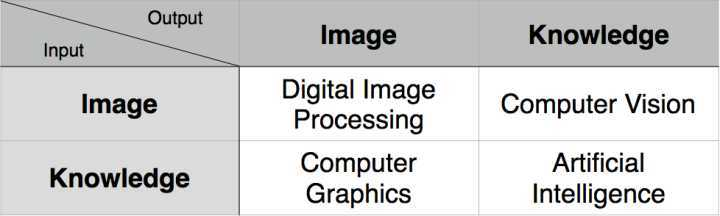
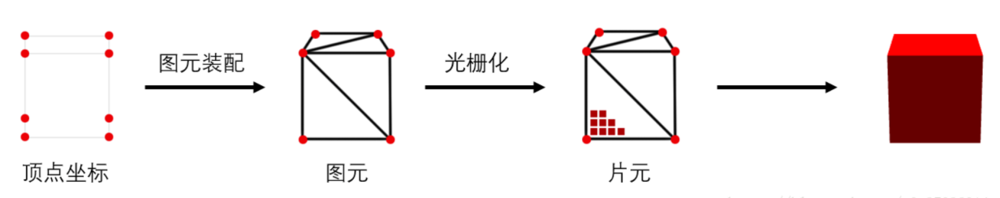
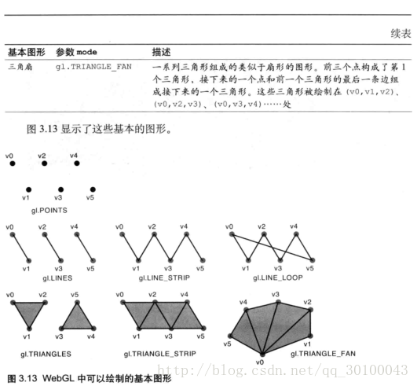

<!-- vscode-markdown-toc -->
* 1. [图形学](#)
* 2. [WebGL 基础概念](#WebGL)
* 3. [GSGL基础](#GSGL)
	* 3.1. [GLSL语言及编译：](#GLSL)
	* 3.2. [传输类型](#-1)
	* 3.3. [顶点、片元着色器中类型](#-1)
	* 3.4. [数据类型](#-1)
	* 3.5. [绘制方式](#-1)
* 4. [webgl绘制点线面](#webgl)
	* 4.1. [绘制没有变量的固定点（const）](#const)
	* 4.2. [绘制添加变量的多个点（attribute变量vec4类型）外联着色器](#attributevec4)
	* 4.3. [webgl简单封装](#webgl-1)
	* 4.4. [最简三角面](#-1)
	* 4.5. [彩色三角 varying顶点](#varying)
	* 4.6. [全局变量uniform位移](#uniform)
	* 4.7. [坐标系初探](#-1)
	* 4.8. [小结](#-1)

<!-- vscode-markdown-toc-config
	numbering=true
	autoSave=true
	/vscode-markdown-toc-config -->
<!-- /vscode-markdown-toc -->

# 基础绘制

##  1. <a name=''></a>图形学

图形学概念：也称为计算机图形学（ComputerGraphics），简称CG。它是研究图形的输入、模型(图形对象)的构造和表示、图形数据库管理、图形数据通信、图形的操作、图形数据的分析，以及如何以图形信息为媒介实现人机交互作用的方法、技术和应用的一门学科。它包括图形系统硬件(图形输入-输出设备、图形工作站)图形软件、算法和应用等几个方面。

研究内容：非常广泛，如图形硬件、图形标准、图形交互技术、光栅图形生成算法、曲线曲面造型、实体造型、真实感图形计算与显示算法，以及科学计算可视化、计算机动画、自然景物仿真、虚拟现实等。

编程思想：图形编程本质上是一种复杂的状态机，使用特殊低级语言的高度软硬件结合开发方式，基础图形库（OpenGL D3D）多为纯过程化编程，可以控制大部分软硬件环节但极其繁琐，因此工程使用基本都基于各种更上层的库 osg ogre vtk unreal unity cesium threejs babylonjs filament等

主要应用是数据处理和交互展示。

>数字图像处理、计算机视觉、计算机图形学和人工智能都与GPU和图形图像数据紧密相关，四者相辅相成互有交集，主要区别如下：
>
>主要共通点是数据计算和硬件平台

<br>
<br>
<br>

##  2. <a name='WebGL'></a>WebGL 基础概念

* WebGL的[基础空间坐标系](./附录_0.1.坐标系.md "基础空间坐标系")是右手坐标系
* WebGL不是完整的3D API，仅仅是一个光栅化引擎（低级别），只可以绘制出基础的点，线和三角形。  
* 复杂图形和样式需要通过js代码，组合使用点线三角形代替实现。
>

<br>
<br>

WebGL在电脑的GPU中运行。因此你需要使用能够在GPU上运行的代码。
这样的代码需要提供成对的方法。每对方法中一个叫顶点着色器，
另一个叫片断着色器，并且使用一种和C或C++类似的强类型的语言
[GLSL](webgl-shaders-and-glsl.html)。 (GL着色语言)。
每一对组合起来称作一个 *program*（着色程序）。

>顶点着色器计算顶点的位置。根据计算的位置，WebGL对点，
线和三角形等图元进行光栅化处理。  
当对这些图元进行光栅化处理时需要使用片断着色器方法。
片断着色器的作用是计算出当前绘制图元中每个像素的颜色值。


几乎整个WebGL API都是关于如何设置这些成对方法的状态值以及运行它们。
对于想要绘制的每一个对象，都需要先设置一系列状态值，然后通过调用
`gl.drawArrays` 或 `gl.drawElements` 运行一个着色方法对，使得你的着色器对能够在GPU上运行。

<br>
<br>
<br>

##  3. <a name='GSGL'></a>GSGL基础

###  3.1. <a name='GLSL'></a>GLSL语言及编译：

  GLSL(OpenGL着色语言OpenGL Shading Language)是一门类C的强类型语言


图形编程是CPU语言和GPU语言的混合：

- GSGL - [CPU 编译链接] -> GPU可执行程序  
- 数据 - [CPU 处理 ] - [CPU发送GPU接收  通过缓冲区传输到GPU硬件]- [GPU执行GPU可执行程序  处理] -> 屏幕显示

[CPU程序 编译链接]：CPU通过webgl api控制着色器代码编译链接  

[GPU可执行程序在GPU上 处理]：GPU可执行程序和GPU硬件综合负责数据处理和渲染功能（软解硬解），渲染流程主要在GPU硬件上执行，但渲染流程（图形管道graphic pipeline）并不是一成不变的（GPU可以看作一种特殊稳定的嵌入式烧录卡）

>数据在GPU中展示为屏幕像素是一种单向流式处理（向前渲染）的图形管道(graphic pipeline)，类似于一段不断加染色剂的水管，最终计算成果是屏幕上显示的像素<font size=3 color=#F00>CPU与GPU不是一个硬件，无法直接获取其返回值，也不存在传地址（参）的指针绑定，获取值的通常方法为屏幕取像素值！！！</font>（特殊情况未普及的新标准计算着色器待定）。


着色器有两种类型：

- 顶点着色器(Vertex Shader)-- 形状转换到真实的3D绘制坐标中  
- 片段着色器(Fragment Shader)-- 计算最终渲染的颜色和其他属性

GLSL是强类型语言, 并且内置很多数学公式用于计算向量和矩阵. 快速编写着色器非常复杂, 但创建一个简单的着色器并不难. （方便理解，我们可以将之当作<font size=3 color=#F00>一门特殊的解释型语言！</font>，其编译和链接交给js或其他cpu语言来实时控制）


###  3.2. <a name='-1'></a>传输类型
GPU可执行程序所需的任何数据都需要发送到GPU，这里有着色器获取数据的4种方法:

1. 属性（Attributes）和缓冲

   缓冲是发送到GPU的一些二进制数据序列，通常情况下缓冲数据包括位置，法向量，纹理坐标，顶点颜色值等。
   你可以存储任何数据。

   属性用来指明怎么从缓冲中获取所需数据并将它提供给顶点着色器。
   例如你可能在缓冲中用三个32位的浮点型数据存储一个位置值。
   对于一个确切的属性你需要告诉它从哪个缓冲中获取数据，获取什么类型的数据（三个32位的浮点数据），
   起始偏移值是多少，到下一个位置的字节数是多少。

   缓冲不是随意读取的。事实上顶点着色器运行的次数是一个指定的确切数字，
   每一次运行属性会从指定的缓冲中按照指定规则依次获取下一个值。

2. 全局变量（Uniforms）

   全局变量在着色程序运行前赋值，在运行过程中全局有效。

3. 纹理（Textures）

   纹理是一个数据序列，可以在着色程序运行中随意读取其中的数据。
   大多数情况存放的是图像数据，但是纹理仅仅是数据序列，
   你也可以随意存放除了颜色数据以外的其它数据。

4. 可变量（Varyings）

   可变量是一种顶点着色器给片断着色器传值的方式，依照渲染的图元是点，
   线还是三角形，顶点着色器中设置的可变量会在片断着色器运行中获取不同的插值。

###  3.3. <a name='-1'></a>顶点、片元着色器中类型

顶点着色器需要的数据，可以通过以下三种方式获得:

- Attributes 属性 (从缓冲中获取的数据)  
- Uniforms 全局变量 (在一次绘制中对所有顶点保持一致值)  
- Textures 纹理 (从像素或纹理元素中获取的数据)  

片断着色器所需的数据，可以通过以下三种方式获取：

- Varyings 可变量 (数据从顶点着色器传递并插值)  
- Uniforms 全局变量  (在一次绘制中对所有顶点保持一致值)  
- Textures 纹理 (从像素或纹理元素中获取的数据) 

###  3.4. <a name='-1'></a>数据类型


|  	  Type		| 		Meaning 		|
|:-------------|:-------------|
| 第一行第一列，左对齐| 第一行第二列居中  |
| 第二行第一列，左对齐| 第二行第二列，居中  |
| Bool| 条件类型，取值为true或false| 
| Int| 有符号整数| 
| float| 浮点标量| 
|vec2/vec3/vec4|2/3/4 分量的浮点向量|
|bvec2/bvec3/bvec4 |2/3/4 分量布尔向量|
|ivec2/ivec3/ivec4|2/3/4 分量的整数向量|
|Mat2/Mat3/Mat4|2×2/3x3/4×4 浮点矩阵|
|sampler2D|访问2D纹理的句柄|
|samplerCube|是访问立方体映射纹理的句柄|

类似CPU语言的int float 等类型，GPU中传输和使用数据需要在硬件中预先设置空间，但GSGL规定更加严格，其需要对int和float等基础类型添加精度（类似c中和数据库中int4 int8），

搭配基础类型使用的精度限定符有三个:lowp mediump highp  
```c
precision mediump float  // mediump (-2^14, 2^14)
```


部分情况下需要多个float拼接接受数据传输，例如JavaScript 中的Number类型精度为double类型，而WebGL中浮点数精度为float，所以数据在cpu传入GPU做渲染过程中会有精度损失（会导致深度检测失败、渲染中闪动等问题）

因此需要precision mediump float
最常用的vec4和Mat4，


###  3.5. <a name='-1'></a>绘制方式

WebGL方法gl.drawArrays()通过给第一个参数指定不同的值，可用7种不同的方式来绘制图形



实际场景中除特殊情况，基本为三角带绘制

<br>
<br>
<br>

##  4. <a name='webgl'></a>webgl绘制点线面

###  4.1. <a name='const'></a>绘制没有变量的固定点（const）

<iframe height="300" style="width: 100%;" scrolling="no" title="WebGL教程-WebGL基础-0.1.基础绘制——webgl绘制点线面————0绘制没有变量的固定点（const）" src="https://codepen.io/itild/embed/YzYpogr?default-tab=html%2Cresult&editable=true&theme-id=light" frameborder="no" loading="lazy" allowtransparency="true" allowfullscreen="true">
  See the Pen <a href="https://codepen.io/itild/pen/YzYpogr">
  WebGL教程-WebGL基础-0.1.基础绘制——webgl绘制点线面————0绘制没有变量的固定点（const）</a> by lpp (<a href="https://codepen.io/itild">@itild</a>)
  on <a href="https://codepen.io">CodePen</a>.
</iframe>

HTML+shader

```html
<html>
<head>
  <!-- 顶点着色器 -->
  <script type='x-shader/x-vertex' id='shader-vs'>
    void main(){
            gl_Position=vec4(0.0,0.0,0.0,1.0);
            gl_PointSize=10.0;
        }
    </script>
  <!-- 片段着色器 -->
  <script type='x-shader/x-fragment' id='shader-fs'>
    void main(){
            gl_FragColor=vec4(1.0,1.0,0.0,1.0);
        }
    </script>
</head>

<body>
  <canvas id='webgldom' width='300' height='200'></canvas>
</body>

</html>
```

JS调用WebGL api

```js
// 1.获取webgl
let canvas = document.getElementById("webgldom");
let gl = canvas.getContext("webgl");//WebGLRenderingContext对象 绘图上下文

// 2.清空屏幕
gl.clearColor(0.5, 0.5, 0.5, 1.0);
gl.clear(gl.COLOR_BUFFER_BIT);

// 3.初始化着色器程序
let vs_source = document.getElementById("shader-vs").innerHTML,
  fs_source = document.getElementById("shader-fs").innerHTML;

// 创建顶点着色器对象
let vertexShader = gl.createShader(gl.VERTEX_SHADER);//创建空着色器对象  type gl.VERTEX_SHADER 顶点着色器
let fragmentShader = gl.createShader(gl.FRAGMENT_SHADER);
gl.shaderSource(vertexShader, vs_source);// 绑定资源
gl.shaderSource(fragmentShader, fs_source);

//************************ 编译 ************************
gl.compileShader(vertexShader);//编译顶点着色器
gl.compileShader(fragmentShader);//编译片元着色器

// 创建一个着色器程序
let glProgram = gl.createProgram();
// 添加组合
gl.attachShader(glProgram, vertexShader);// 顶点着色器对象添加到着色器程序
gl.attachShader(glProgram, fragmentShader);// 片元着色器对象添加到着色器程序

//************************ 链接 ************************
gl.linkProgram(glProgram);//把着色器程序链接！！成一个完整的程序
gl.useProgram(glProgram);// 使用这个完整的程序
// 4.绘制一个点
gl.drawArrays(gl.POINTS, 0, 1);

```
<!-- https://webglfundamentals.org/webgl/lessons/zh_cn/webgl-shaders-and-glsl.html -->
<br>
<br>
<br>

###  4.2. <a name='attributevec4'></a>绘制添加变量的多个点（attribute变量vec4类型）外联着色器

<br>
上一个例子是编译好的固定单点着色器程序，画多个点，首先需要给GPU提供多个顶点  

<font size=3 color=#F00>通信机制：</font>跨语言通信首先要有传输机制和类型对应,js与shader跨硬件和语言，为了解决这个问题，webgl 系统就建立了一个供js向shader传输的缓冲区存储数据（数据与负责显示的程序分离）

WebGL提供了<font size=3 color=#F00>缓冲区对象</font>（一个全局数组）来连续存放多个顶点的数据，然后使用drawArrays一次性画出来，要引入着色器变量才行。

<iframe height="300" style="width: 100%;" scrolling="no" title="WebGL教程-WebGL基础-0.1.基础绘制——webgl绘制点线面————1绘制添加变量的多个点（attribute变量vec4类型）_外联" src="https://codepen.io/itild/embed/KKZaKzx?default-tab=html%2Cresult&editable=true&theme-id=light" frameborder="no" loading="lazy" allowtransparency="true" allowfullscreen="true">
  See the Pen <a href="https://codepen.io/itild/pen/KKZaKzx">
  WebGL教程-WebGL基础-0.1.基础绘制——webgl绘制点线面————1绘制添加变量的多个点（attribute变量vec4类型）_外联</a> by lpp (<a href="https://codepen.io/itild">@itild</a>)
  on <a href="https://codepen.io">CodePen</a>.
</iframe>

HTML

```html
<canvas id="webgldom" width="200" height="200"></canvas> 
```

JS调用WebGL api + shader

```js
// 顶点着色器代码(决定顶点在哪里，大小)
var VSHADER_SOURCE =
  //************************attribute vec4 a_Position********************************// 
  //vec4是GLSL中的一种数据类型，在这里表示GLSL的四维浮点数向量
  //默认值为(0.0,0.0,0.0,1.0)，表示(x,y,z,w)。当有字段缺失时，会填充对应的默认值。
  //js中 Float32Array([0.0, 0.5, -0.5, -0.5, 0.5, -0.5]);
  //(0.0, 0.5,0.0,1.0)，(-0.5,-0.5,0.0,1.0)，(0.5, -0.5,0.0,1.0)
  "attribute vec4 a_Position;\n" +
  "void main() {\n" +
  "  gl_Position = a_Position;\n" + // 设置顶点的位置
  "  gl_PointSize = 10.0;\n" + // 设置顶点的大小
  "}\n";

// 片元着色器代码（给像素上色）
var FSHADER_SOURCE =
  "void main() {\n" +
  "  gl_FragColor = vec4(1.0, 0.0, 0.0, 1.0);\n" + // 设置顶点的颜色
  "}\n";

// 1.获取webgl
let canvas = document.getElementById("webgldom");
let gl = canvas.getContext("webgl"); //WebGLRenderingContext对象 绘图上下文

// 2.清空屏幕
gl.clearColor(0.5, 0.5, 0.5, 1.0);
gl.clear(gl.COLOR_BUFFER_BIT);

// 3.初始化着色器程序
let vertexShader = gl.createShader(gl.VERTEX_SHADER); //创建空着色器对象 type gl.VERTEX_SHADER 顶点着色器
gl.shaderSource(vertexShader, VSHADER_SOURCE); // 绑定资源
gl.compileShader(vertexShader); // 编译

let fragmentShader = gl.createShader(gl.FRAGMENT_SHADER); //创建空着色器对象 片元
gl.shaderSource(fragmentShader, FSHADER_SOURCE); // 绑定资源
gl.compileShader(fragmentShader); // 编译

// 创建一个着色器程序
let glProgram = gl.createProgram();
// 添加组合
gl.attachShader(glProgram, vertexShader); // 顶点着色器对象添加到着色器程序
gl.attachShader(glProgram, fragmentShader); // 片元着色器对象添加到着色器程序

//************************ 链接 ************************
gl.linkProgram(glProgram); //把着色器程序链接！！成一个完整的程序
gl.useProgram(glProgram); // 使用这个完整的程序

// *****************************************变量*************************
// 此处用到顶点缓冲区
let vertices = new Float32Array([0.0, 0.5, -0.5, -0.5, 0.5, -0.5]); // 三个点Float32 类型
// 画三个点
let n = 3;
// 创建一个缓存对象，用于存放顶点数据
let vertexBuffer = gl.createBuffer();
// 绑定缓存对象
gl.bindBuffer(gl.ARRAY_BUFFER, vertexBuffer);
// 把数据写到缓冲对象中
gl.bufferData(gl.ARRAY_BUFFER, vertices, gl.STATIC_DRAW);
// 获取顶点着色器代码中的顶点变量
let a_Position = gl.getAttribLocation(glProgram, "a_Position");
// 设置变量获取数据规则
gl.vertexAttribPointer(a_Position, 2, gl.FLOAT, false, 0, 0);
// 允许变量从 ARRAY_BUFFER目标上绑定的缓冲区对象获取数据
gl.enableVertexAttribArray(a_Position);
// *****************************************end*************************

// 4.绘制n个点
gl.drawArrays(gl.POINTS, 0, n);


```

重要理解void gl.vertexAttribPointer(index, size, type, normalized, stride, offset);

* index指定要修改的顶点属性的索引。 
* 
* size指定每个顶点属性的组成数量，必须是1，2，3或4。
* 
* type指定数组中每个元素的数据类型可能是：
*  * gl.FLOAT:32位IEEE标准的浮点数
*  * gl.BYTE: 有符号的8位整数，范围[-128, 127]
*  * gl.SHORT: 有符号的16位整数，范围[-32768, 32767]
*  * gl.UNSIGNED_BYTE: 无符号的8位整数，范围[0, 255]
*  * gl.UNSIGNED_SHORT: 无符号的16位整数，范围[0, 65535]
* * 使用WebGL2版本的还可以使用以下值：
* * * gl.HALF_FLOAT: 16位IEEE标准的浮点数
* 
* normalized 当转换为浮点数时是否应该将整数数值归一化到特定的范围。
* * * 对于类型gl.BYTE和gl.SHORT，如果是true则将值归一化为[-1, 1]
* * * 对于类型gl.UNSIGNED_BYTE和gl.UNSIGNED_SHORT，如果是true则将值归一化为[0, 1]
* * * 对于类型gl.FLOAT和gl.HALF_FLOAT，此参数无效
* 
* stride不能大于255。如果stride为0，则假定该属性是紧密打包的，即不交错属性，每个属性在一个单独的块中，下一个顶点的属性紧跟当前顶点之后。
* 
* offset指定顶点属性数组中第一部分的字节偏移量。必须是类型的字节长度的倍数。

###  4.3. <a name='webgl-1'></a>webgl简单封装

<iframe height="300" style="width: 100%;" scrolling="no" title="WebGL教程-WebGL基础-0.1.基础绘制——webgl绘制点线面————2绘制添加变量的多个点（attribute变量vec4类型）_外联_封装" src="https://codepen.io/itild/embed/LYebymP?default-tab=html%2Cresult&editable=true&theme-id=light" frameborder="no" loading="lazy" allowtransparency="true" allowfullscreen="true">
  See the Pen <a href="https://codepen.io/itild/pen/LYebymP">
  WebGL教程-WebGL基础-0.1.基础绘制——webgl绘制点线面————2绘制添加变量的多个点（attribute变量vec4类型）_外联_封装</a> by lpp (<a href="https://codepen.io/itild">@itild</a>)
  on <a href="https://codepen.io">CodePen</a>.
</iframe>

HTML

```html
<canvas id="webgldom" width="200" height="200"></canvas> 
```

JS调用WebGL api + shader

```js
/**
 * _ 私有属性和方法
 *
 * 无状态或纯pipe式处理 静态工具类
 */
class GLStart {
  constructor() {}

  /**
   * 编译shader代码
   * @param {*} gl
   * @param {*} type
   * @param {*} source
   *  const vertexShader = _loadShader(gl, gl.VERTEX_SHADER, vsSource);
   * @returns
   */
  static _loadShader(gl, type, source) {
    const shader = gl.createShader(type); // 创建着色器对象
    gl.shaderSource(shader, source); // 提供shader代码  绑定资源
    gl.compileShader(shader); // 编译 -> 生成着色器
    return shader;
  }

  /**
   * 初始化一个着色程序
   * @param {*} gl
   * @param {*} vsSource
   * @param {*} fsSource
   * @returns
   */
  static initShaderProgram(gl, vsSource, fsSource) {
    const vertexShader = this._loadShader(gl, gl.VERTEX_SHADER, vsSource);
    const fragmentShader = this._loadShader(gl, gl.FRAGMENT_SHADER, fsSource);

    // Create the shader program

    const shaderProgram = gl.createProgram();
    gl.attachShader(shaderProgram, vertexShader);
    gl.attachShader(shaderProgram, fragmentShader);
    gl.linkProgram(shaderProgram);
    return shaderProgram;
  }
}

// 顶点着色器代码(决定顶在哪里，大小)
let VSHADER_SOURCE =
  "attribute vec4 a_Position;\n" +
  "void main() {\n" +
  "  gl_Position = a_Position;\n" + // 设置顶点的位置
  "  gl_PointSize = 10.0;\n" + // 设置顶点的大小
  "}\n";

// 片元着色器代码（给像素上色）
let FSHADER_SOURCE =
  "void main() {\n" +
  "  gl_FragColor = vec4(1.0, 0.0, 0.0, 0.5);\n" + // 设置顶点的颜色
  "}\n";

// 1.获取webgl
let canvas = document.getElementById("webgldom");
let gl = canvas.getContext("webgl"); //WebGLRenderingContext对象 绘图上下文
// 2.清空屏幕
gl.clearColor(0.5, 0.5, 0.5, 1.0);
gl.clear(gl.COLOR_BUFFER_BIT);

// 3.初始化着色器程序
let program = GLStart.initShaderProgram(gl, VSHADER_SOURCE, FSHADER_SOURCE);
gl.program = program;
gl.useProgram(program);
let n = initVertexBuffers(gl, [0.0, 0.5, -0.5, -0.5, 0.5, -0.5]);

// 画n个点
gl.drawArrays(gl.POINTS, 0, n);

function initVertexBuffers(gl, jsArray) {
  let vertices = new Float32Array(jsArray);

  let vertexBuffer = gl.createBuffer(); // 创建一个缓存对象，用于存放顶点数据
  gl.bindBuffer(gl.ARRAY_BUFFER, vertexBuffer); // 绑定缓存对象
  gl.bufferData(gl.ARRAY_BUFFER, vertices, gl.STATIC_DRAW); // 把数据写到缓冲对象中
  let a_Position = gl.getAttribLocation(gl.program, "a_Position"); // 获取顶点着色器代码中的顶点变量
  gl.vertexAttribPointer(a_Position, 2, gl.FLOAT, false, 0, 0); // 设置变量获取数据规则
  gl.enableVertexAttribArray(a_Position); // 允许变量从 ARRAY_BUFFER目标上绑定的缓冲区对象获取数据
  return vertices.length / 2; //返回顶点数量
}


```

###  4.4. <a name='-1'></a>最简三角面

极少量修改即可生成三角面，三角和三角带是实际应用最广的绘制方式

<iframe height="300" style="width: 100%;" scrolling="no" title="WebGL教程-WebGL基础-0.1.基础绘制——webgl绘制点线面————2绘制添加变量的多个点（attribute变量vec4类型）_外联_封装" src="https://codepen.io/itild/embed/VwyPbRY?default-tab=html%2Cresult&theme-id=light" frameborder="no" loading="lazy" allowtransparency="true" allowfullscreen="true">
  See the Pen <a href="https://codepen.io/itild/pen/VwyPbRY">
  WebGL教程-WebGL基础-0.1.基础绘制——webgl绘制点线面————2绘制添加变量的多个点（attribute变量vec4类型）_外联_封装</a> by lpp (<a href="https://codepen.io/itild">@itild</a>)
  on <a href="https://codepen.io">CodePen</a>.
</iframe>

```js
······

// - "  gl_PointSize = 10.0;\n" + // 设置顶点的大小

·····

// - // 画n个点
// - gl.drawArrays(gl.POINTS, 0, n);
// +
// 绘制三角形
gl.drawArrays(gl.TRIANGLES, 0, n);


```

###  4.5. <a name='varying'></a>彩色三角 varying顶点

<iframe height="300" style="width: 100%;" scrolling="no" title="WebGL教程-WebGL基础-0.1.基础绘制——webgl绘制点线面————2绘制三角_外联_封装" src="https://codepen.io/itild/embed/JjMEJaX?default-tab=html%2Cresult&theme-id=light" frameborder="no" loading="lazy" allowtransparency="true" allowfullscreen="true">
  See the Pen <a href="https://codepen.io/itild/pen/JjMEJaX">
  WebGL教程-WebGL基础-0.1.基础绘制——webgl绘制点线面————2绘制三角_外联_封装</a> by lpp (<a href="https://codepen.io/itild">@itild</a>)
  on <a href="https://codepen.io">CodePen</a>.
</iframe>

```js
// 顶点着色器代码(决定顶在哪里，大小)
let VSHADER_SOURCE =
  "attribute vec4 a_Position;\n" +
//+ 添加varying 
  "varying vec4 v_color;\n" +
  "void main() {\n" +
  "gl_Position = a_Position;\n" + // 设置顶点的位置
   "v_color = gl_Position  + 0.5;\n" + // 设置color
  "}\n";

// 片元着色器代码（给像素上色）let FSHADER_SOURCE 

let FSHADER_SOURCE =
 "precision mediump float;\n" +
  "varying vec4 v_color;\n" +
  "void main() {\n" +
 "gl_FragColor = v_color;\n" + // 设置顶点的颜色
  "}\n";
```

###  4.6. <a name='uniform'></a>全局变量uniform位移

<iframe height="300" style="width: 100%;" scrolling="no" title="WebGL教程-WebGL基础-0.1.基础绘制——webgl绘制点线面————2绘制彩色三角varying传值" src="https://codepen.io/itild/embed/VwyPMOY?default-tab=html%2Cresult&theme-id=light" frameborder="no" loading="lazy" allowtransparency="true" allowfullscreen="true">
  See the Pen <a href="https://codepen.io/itild/pen/VwyPMOY">
  WebGL教程-WebGL基础-0.1.基础绘制——webgl绘制点线面————2绘制彩色三角varying传值</a> by lpp (<a href="https://codepen.io/itild">@itild</a>)
  on <a href="https://codepen.io">CodePen</a>.
</iframe>

```js

// 顶点着色器代码(决定顶在哪里，大小)
let VSHADER_SOURCE =
  "attribute vec4 a_Position;\n" +
  // + uniform
  "uniform vec4 v_move;\n" +
  "varying vec4 v_color;\n" +
  "void main() {\n" +
  // + uniform
  "gl_Position = a_Position+v_move;\n" + // 设置顶点的位置
   "v_color = gl_Position  + 0.5;\n" + // 设置color
  "}\n";

................
// +
function initVertexBuffers(gl, jsArray) {
  let vertices = new Float32Array(jsArray);

  let vertexBuffer = gl.createBuffer(); // 创建一个缓存对象，用于存放顶点数据
  gl.bindBuffer(gl.ARRAY_BUFFER, vertexBuffer); // 绑定缓存对象
  gl.bufferData(gl.ARRAY_BUFFER, vertices, gl.STATIC_DRAW); // 把数据写到缓冲对象中
  let a_Position = gl.getAttribLocation(gl.program, "a_Position"); // 获取顶点着色器代码中的顶点变量
  gl.vertexAttribPointer(a_Position, 2, gl.FLOAT, false, 0, 0); // 设置变量获取数据规则
  gl.enableVertexAttribArray(a_Position); // 允许变量从 ARRAY_BUFFER目标上绑定的缓冲区对象获取数据
  // ++ 设置全局变量v_move
  let v_move = gl.getUniformLocation(gl.program, 'v_move');
  gl.uniform4f(v_move, 0.5, 0.0, 0.0, 0.0);  
  
  return vertices.length / 2; //返回顶点数量
}
```

如果使用attribute传递单个值会如何

attribute传输那些和顶点数据有关的数据（例如，顶点位置、法向量、顶点颜色<每个顶点都对应一个颜色>），

<iframe height="300" style="width: 100%;" scrolling="no" title="WebGL教程-WebGL基础-0.1.基础绘制——webgl绘制点线面————2绘制彩色三角uniform偏移" src="https://codepen.io/itild/embed/mdpRqQB?default-tab=html%2Cresult&theme-id=light" frameborder="no" loading="lazy" allowtransparency="true" allowfullscreen="true">
  See the Pen <a href="https://codepen.io/itild/pen/mdpRqQB">
  WebGL教程-WebGL基础-0.1.基础绘制——webgl绘制点线面————2绘制彩色三角uniform偏移</a> by lpp (<a href="https://codepen.io/itild">@itild</a>)
  on <a href="https://codepen.io">CodePen</a>.
</iframe>


```js

// 顶点着色器代码(决定顶在哪里，大小)
let VSHADER_SOURCE =

  //- "varying vec4 v_move;\n" +
  // +
  "attribute vec4 v_move;\n" +

..................

  // let v_move = gl.getUniformLocation(gl.program, 'v_move');
  // gl.uniform4f(v_move, 0.5, 0.0, 0.0, 0.0);    
  // 设置v_move
  // +
  const v_move = gl.getAttribLocation(gl.program, 'v_move');
  gl.vertexAttrib4f(v_move, 0.5, 0.0, 0.0,0.0);

```
###  4.7. <a name='-1'></a>坐标系初探

<iframe height="300" style="width: 100%;" scrolling="no" title="WebGL教程-WebGL基础-0.1.基础绘制——webgl绘制点线面————2绘制彩色三角attribute偏移" src="https://codepen.io/itild/embed/RwxKexb?default-tab=html%2Cresult&editable=true&theme-id=light" frameborder="no" loading="lazy" allowtransparency="true" allowfullscreen="true">
  See the Pen <a href="https://codepen.io/itild/pen/RwxKexb">
  WebGL教程-WebGL基础-0.1.基础绘制——webgl绘制点线面————2绘制彩色三角attribute偏移</a> by lpp (<a href="https://codepen.io/itild">@itild</a>)
  on <a href="https://codepen.io">CodePen</a>.
</iframe>

```html
<!-- - -->
<!-- <canvas id="webgldom" width="200" height="200"></canvas>  -->
<!-- + -->
<canvas id="webgldom" width="100vw" height="100vh"></canvas> 
```
之所以产生形变，是因为我们未作任何坐标转换（可以视为需要的变换都*1），最终直接输入的-1.0~1.0的裁剪坐标，拟真的动态三维场景需要在多种坐标系间转换，最终显示在屏幕（canvas像素组成的屏幕坐标系）上。

这里仅作静态三角形变形的解释，后续动态绘制会涉及更复杂坐标系换算和画面帧控制。

<iframe height="300" style="width: 100%;" scrolling="no" title="CodePen Home WebGL教程-WebGL基础-0.1.基础绘制——webgl绘制点线面————2坐标系初探" src="https://codepen.io/itild/embed/VwyPExJ?default-tab=html%2Cresult&editable=true&theme-id=light" frameborder="no" loading="lazy" allowtransparency="true" allowfullscreen="true">
  See the Pen <a href="https://codepen.io/itild/pen/VwyPExJ">
  CodePen Home WebGL教程-WebGL基础-0.1.基础绘制——webgl绘制点线面————2坐标系初探</a> by lpp (<a href="https://codepen.io/itild">@itild</a>)
  on <a href="https://codepen.io">CodePen</a>.
</iframe>

###  4.8. <a name='-1'></a>小结

* WEBGL基础静态图形绘制的代码编写和绘制流程
>JS如何组装Shader 调用WEBGL API 编译链接执行程序

* 极其底层的Webgl Api和shader代码渲染复杂场景
>顶点着色器、片元着色器、传输数据方式、绘制方法在符合规则情况下可以相互搭配（数据量与绘制方式相匹配，比如三角形绘制必须缓冲区内三个点以上等），基于这一点，我们可以组装装配出复杂的几何图形渲染流程（图形管道graphic pipeline）

