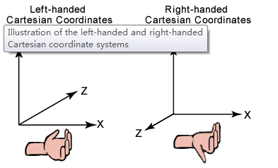

<!-- vscode-markdown-toc -->
* 1. [基础坐标系](#)
* 2. [场景坐标（空间 局部坐标）](#-1)

<!-- vscode-markdown-toc-config
	numbering=true
	autoSave=true
	/vscode-markdown-toc-config -->
<!-- /vscode-markdown-toc -->

# 坐标系
##  1. 基础坐标系
基础坐标系只描述方向，没有单位！！！

维度的描述是有方向的，一维（x）中坐标轴改为反向，二维中（x,y）一轴改为反向，三维中固定其中两轴一轴改为反向。改变了空间基准，改变前后空间永远不能出现同一场景。

不同基础坐标导致的问题
* 二维中：
* * GPS测量的点位数据投影后坐标翻转问题（笛卡尔坐标系和高斯坐标系）  
高斯平面直角坐标系. 高斯平面直角坐标系是以每一带的中央子午线的投影为X轴，赤道的投影为Y轴，各投影带自成一个平面直角坐标系统。

* 三维中：
* * 桌面端基于d3d开发的模型软件处理后的模型，在基于webgl开发的应用中侧立翻转

>Direct3D使用的是左手坐标系，OpenGL使用的是右手坐标系。

##  2. 场景坐标（空间 局部坐标）

不同的坐标系统也被称作相应的空间，顶点在最终被转化为片元之前需要经历的坐标系统（空间）：

* 局部空间（Local Space）/ 物体空间（Object Space）
* 世界空间（World Space）
* 观察空间（View Space）/ 视觉空间（Eye Space）
* 裁剪空间（Clip Space）
* 屏幕空间（Screen Space）

顶点坐标一步步变换到屏幕空间,而坐标从一个空间到另一个空间则需要变换矩阵来完成这一过程：
模型矩阵（Model Matrix）
观察矩阵（View Matrix）
投影矩阵（Projection Matrix）

为上述每一个步骤都创建相应的变换矩阵：模型矩阵、观察矩阵和投影矩阵。

一个顶点坐标将会根据以下过程被变换到裁剪坐标： 。

顶点着色器的输出要求所有的顶点都在裁剪空间内，这就是使用变换矩阵做的，然后WebGL对裁剪坐标执行透视除法从而将它们变换到标准化设备坐标；WebGL使用内部参数来标准化设备坐标映射到屏幕坐标，每一个坐标都关联了一个屏幕上的点，这个过程称为视口变换。

>局部空间  
>* 局部空间是指物体所在的坐标空间，即对象最开始所在的地方。在局部空间中，物体位于空间的原点，所有的调整都是基于物体的相对位置进行的。

>世界空间
>* 世界空间是指虚拟的场景所在的空间，比如游戏场景等。它指顶点相对于场景的坐标，当所有物体导入程序时，它们有可能会都挤在世界的原点(0.0, 0.0, 0.0)上，我们需要为每一个物体定义一个位置，从而能在更大的场景中合理的摆放让它们。模型矩阵的作用就是通过对物体进行位移、缩放、旋转等操作将其摆放到场景中的不同位置。

>观察空间
>* 我们通过WebGL在屏幕上展现给用户的内容并不是世界空间中摆放的全部内容，而是通过摄像机来模拟用户的眼睛所呈现的场景。观察空间就是从摄像机的视角所观察到的空间，也会称作摄像机空间或视觉空间。

>裁剪空间
>* 摄像机有朝向，也有拍摄的视野范围，所有在视野范围之外的东西都是看不到的，都要被剔除。在每个顶点着色器运行结束的时候，OpenGL希望坐标都在一个指定范围内，超出范围的坐标都会被裁剪掉，剩下的坐标才会进入片元着色阶段，这也就是裁剪空间名字的由来。而投影矩阵就是将物体从观察空间转换到裁剪空间。

