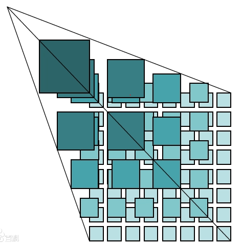
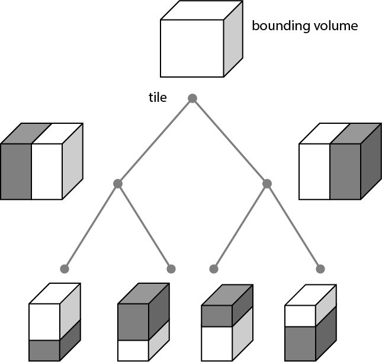
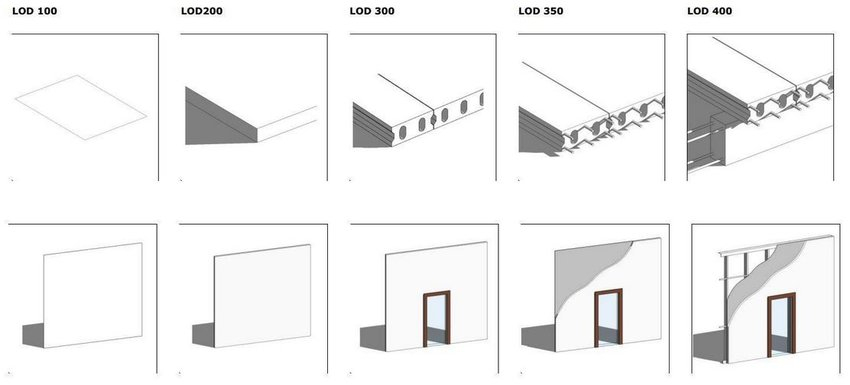
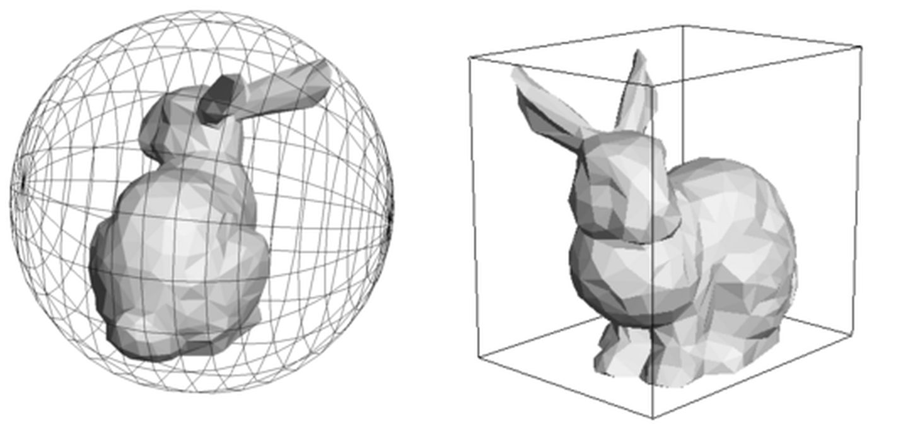

<!-- vscode-markdown-toc -->
* 1. [地形数据（所有GIS场景基准）](#GIS)
* 2. [矢量数据（点/线/面...）](#...)
* 3. [栅格数据（底图）](#)
* 4. [模型数据](#-1)

<!-- vscode-markdown-toc-config
	numbering=true
	autoSave=true
	/vscode-markdown-toc-config -->
<!-- /vscode-markdown-toc -->
##  1. <a name='GIS'></a>地形数据（所有GIS场景基准）
地形测量是离散的点坐标数据，作为可视化用途之前,通过点坐标数据实现对地面地形的数字化模拟线构成DEM(Digital Elevation Model数字高程模型),一般使用三角网构建(不规则和规则)

不规则三角网(TIN, Triangulated Irregular Network)模型采用一系列相连接的三角形拟合地表或其他不规则表面，常用来构造数字地面模型，特别是数字高程模型。最常用的生成方法是Delaunay 剖分方法。三角形剖分是复杂图形与图形学基础图元（三角形）的桥梁，算法很多常用库为[切耳法三角剖分](https://github.com/mapbox/earcut  "github")  

一般由图像记录的规则三角网如下
<iframe height="300" style="width: 100%;" scrolling="no" title="Babylon earth  默认球状表面网格" src="https://codepen.io/itild/embed/rNpjQgN?default-tab=html%2Cresult&editable=true&theme-id=light" frameborder="no" loading="lazy" allowtransparency="true" allowfullscreen="true">
  See the Pen <a href="https://codepen.io/itild/pen/rNpjQgN">
  Babylon earth  默认球状表面网格</a> by lpp (<a href="https://codepen.io/itild">@itild</a>)
  on <a href="https://codepen.io">CodePen</a>.
</iframe>


高度图  图片格式png/tif等（GPU可以传递纹理）  
.terrain  cesium官方格式 


##  2. <a name='...'></a>矢量数据（点/线/面...）
点/线/面/多点/多线/多面/空心多边形（面和空心含（凹凸)）

数据格式
wkt postgis  
WKB  采用二进制进行存储，更方便于计算机处理，因此广泛运用于数据的传输与存储，以二位点Point(1 1)为例，其WKB表达

如下：
01  0100 0020 E6100000  000000000000F03F 000000000000F03F

文件格式：  
> geojson  
```json
{
  "type": "Feature",
  "geometry": {
    "type": "Point",
    "coordinates": [121.5, 38.5]
  },
  "properties": {
    "id": "点0",
    "地址": "大连"
  }
}
```
> shp arcgis  
.shp — 图形格式，用于保存元素的几何实体。  
.shx — 图形索引格式。几何体位置索引，记录每一个几何体在shp文件之中的位置，能够加快向前或向后搜索一个几何体的效率。  
.dbf — 属性数据格式，以dBase III+ 的数据表格式存储每个几何形状的属性数据。
>* ESRI Shapefile（shp），或简称shapefile，是美国环境系统研究所公司（ESRI）开发的空间数据开放格式。目前，该文件格式已经成为了地理信息软件界的开放标准，这表明ESRI公司在全球的地理信息系统市场的重要性。Shapefile也是重要的交换格式，能够在ESRI与其他公司的产品之间进行数据互操作。 
 

> kml 谷歌地球xml语法 


##  3. <a name=''></a>栅格数据（底图）

wms 矢量数据 实时动态后端渲染图片

wmts/tms 影像图片或矢量数据后端渲染图片 金字塔切片后




##  4. <a name='-1'></a>模型数据

obj等传统/gltf/glb

3dtiles
逐渐从模糊变清晰的，由简面变精面的，根据距离的不同所需要渲染的模型的精度不同

LOD：（Level of Details），简称为多细节层次。LOD技术根据模型的节点在显示环境中所处的位置(Screen Size)和重要度，来决定物体渲染的资源分配，降低非重要物体的面数和细节数，从而获得高效率的渲染计算。




LOD实现的前提：  
1.多层次细节模型（可以是多个模型或多层数据 replace和 add）
2.快速判断三维物体是否加载

包围球\包围盒

图形渲染结果一般只能通过canvas.toDataURL ReadPixels() 读取渲染后的屏幕像素返回，
所以鼠标与场景中物体交互和判断数据是否加载的逻辑必须在GPU渲染之前处理，也就是依赖在cpu中声明的对象的包围体。



但cpu无法快速处理复杂空间几何，因此使用简单的几何代替，里面包含着复杂形状的物体。为物体添加包围体的目的是快速的进行碰撞检测或者进行精确的碰撞检测之前进行过滤（即当包围体碰撞，才进行精确碰撞检测和处理）。

如上图，包围球只处理加载距离或范围）和包围体的中心点、半径的关系，包围盒只处理盒子顶点


