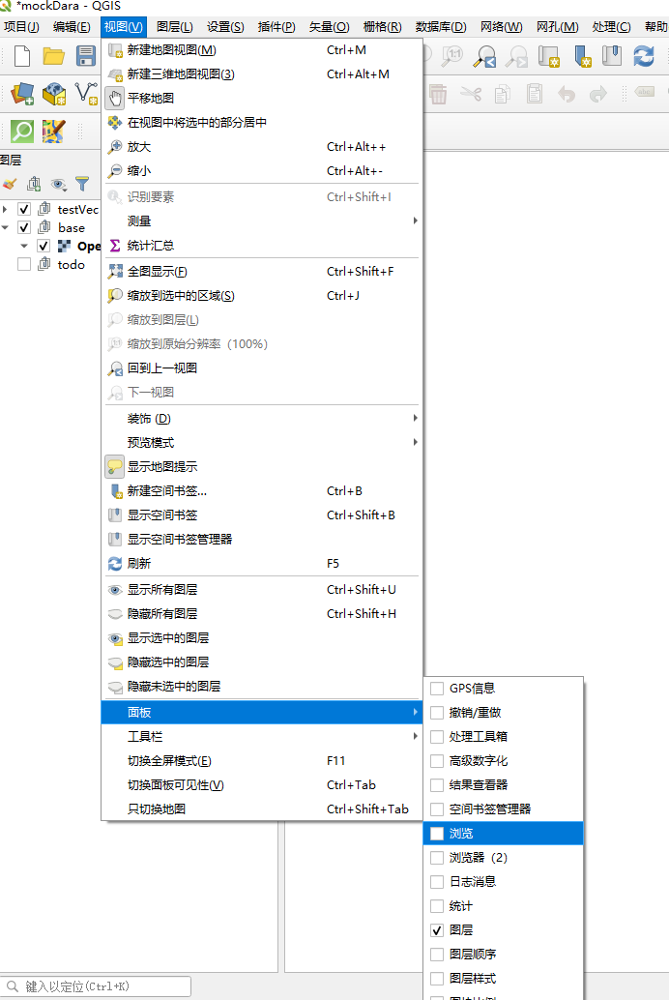
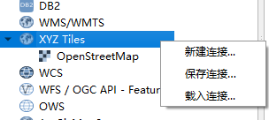

## qgis 基础使用

视图->面板->浏览

>
>

### 添加底图

天地图影像图（无偏移）与高德最底层数据来源一样
https://t3.tianditu.gov.cn/img_w/wmts?SERVICE=WMTS&REQUEST=GetTile&VERSION=1.0.0&LAYER=img&STYLE=default&TILEMATRIXSET=w&FORMAT=tiles&TILECOL={x}&TILEROW={y}&TILEMATRIX={z}&tk=天地图注册浏览器端tk

天地图影像图标注，里面包含了路网和标注
https://t2.tianditu.gov.cn/cia_w/wmts?SERVICE=WMTS&REQUEST=GetTile&VERSION=1.0.0&LAYER=cia&STYLE=default&TILEMATRIXSET=w&FORMAT=tiles&TILECOL={x}&TILEROW={y}&TILEMATRIX={z}&tk=天地图注册浏览器端tk

天地图矢量地图
https://t6.tianditu.gov.cn/vec_w/wmts?SERVICE=WMTS&REQUEST=GetTile&VERSION=1.0.0&LAYER=vec&STYLE=default&TILEMATRIXSET=w&FORMAT=tiles&TILECOL={x}&TILEROW={y}&TILEMATRIX={z}&tk=天地图注册浏览器端tk

天地图矢量标注

 https://t2.tianditu.gov.cn/cva_w/wmts?SERVICE=WMTS&REQUEST=GetTile&VERSION=1.0.0&LAYER=cva&STYLE=default&TILEMATRIXSET=w&FORMAT=tiles&TILECOL={x}&TILEROW={y}&TILEMATRIX={z}&tk=天地图注册浏览器端tk

#### 废物参照图 空间位置加了偏移 精度无用
高德矢量图（偏移？？）
https://webrd02.is.autonavi.com/appmaptile?lang=zh_cn&size=1&scale=1&style=8&x={x}&y={y}&z={z}
 高德影像图（偏移？？）
https://webst01.is.autonavi.com/appmaptile?style=6&x={x}&y={y}&z={z}
 高德路网图
https://wprd01.is.autonavi.com/appmaptile?x={x}&y={y}&z={z}&lang=zh_cn&size=1&scl=2&style=8&ltype=11%0A%0A

#### 待添加

 WMTS服务，以Mapbox为例
Add Mapbox maps as layers in ArcGIS and QGIS with WMTS

如该链接所述，可以用WMTS服务调用Mapbox底图，新建WMTS服务并配置URL为https://api.mapbox.com/styles/v1/mapbox/streets-v11/wmts?access_token=，其中需要自己到官网申请
一个WMTS服务是可以包括多个图层的